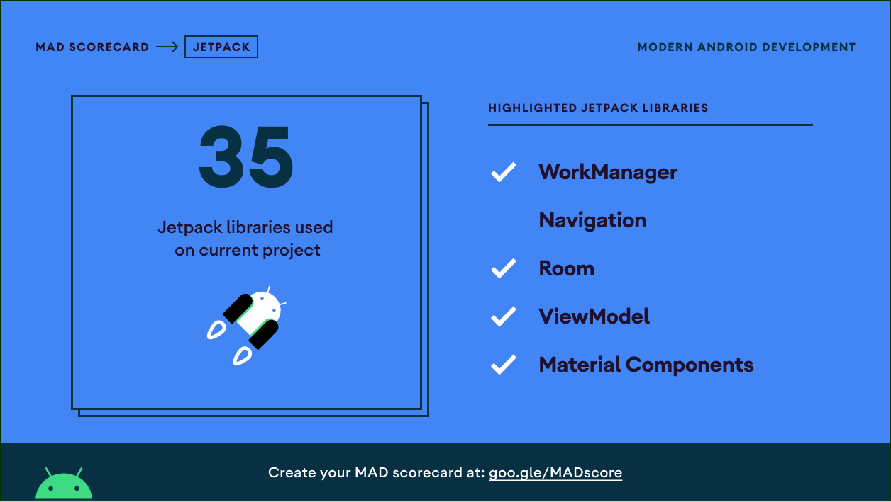

# Suno

This is a podcast application using Media Player 

## Application Install

***You can Install and test latest Suno app from below 👇***

### Features

- Home Screen - Shows list of subscribed podcast
- Search Screen - Shows list of available podcast matching to search term
- Podcast Detail Screen - Shows you list of available  episodes and  details about podcast 
- Episode Detail Screen - Let you play podcast and shows you details about that specific episodes
- EpisodeUpdate  - Notify you if new episodes of subscribed podcast will be available

### Built With

- [Kotlin](https://kotlinlang.org/) - First class and official programming language for Android development.
- [Coroutines](https://kotlinlang.org/docs/reference/coroutines-overview.html) - For asynchronous and more..
- [Android Architecture Components](https://developer.android.com/topic/libraries/architecture) - Collection of libraries that help you design robust, testable, and maintainable apps.
  - [ViewModel](https://developer.android.com/topic/libraries/architecture/viewmodel) - Stores UI-related data that isn't destroyed on UI changes. 
  - [Room](https://developer.android.com/training/data-storage/room) - Room is an android library which is an ORM which wraps android's native SQLite database
  - [Work Manager](https://developer.android.com/topic/libraries/architecture/workmanager) - WorkManager is the recommended solution for persistent work
 
 ### MAD Scorecard

